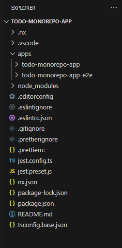
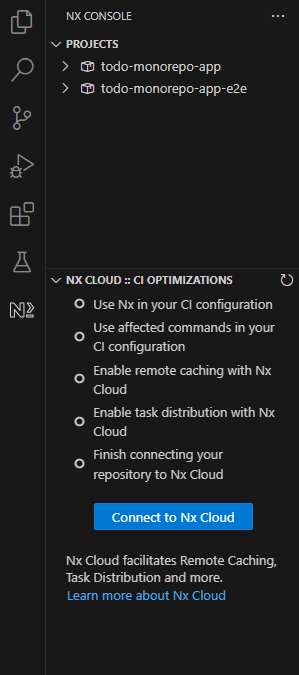
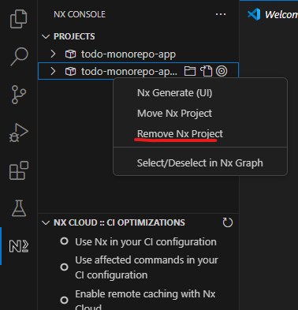
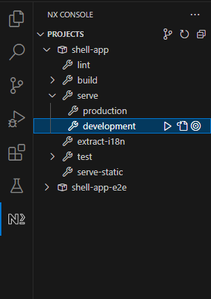
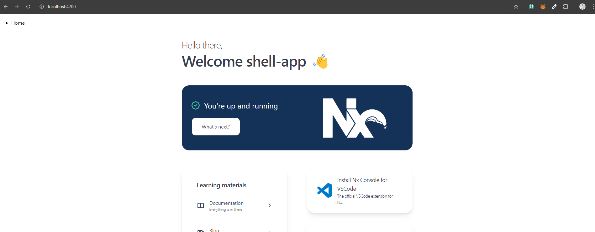
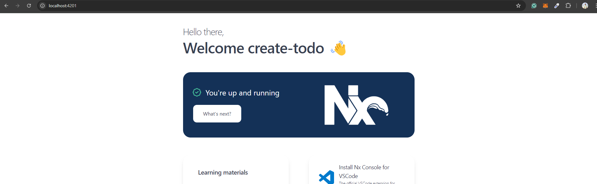
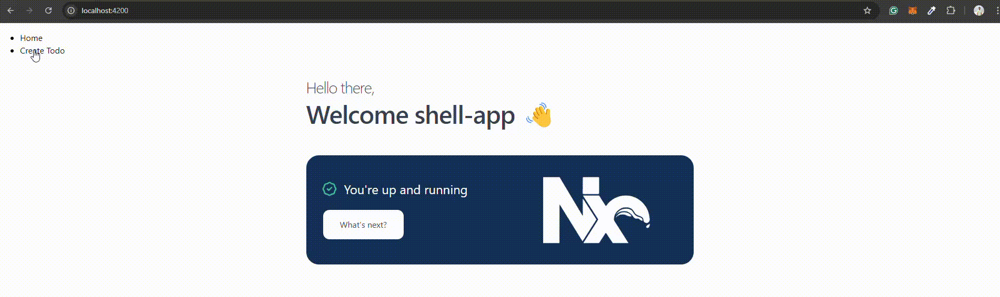

# Todo App using Nx Angular Monorepo with Module Federation

## Overview

This repository contains a **Todo App** built using **Nx**, **Angular**, and **Module Federation**. The project demonstrates the use of Nx's monorepo architecture to manage multiple applications and libraries in a single repository, alongside **Module Federation** to dynamically load micro-frontends.


## Table of Contents

1. [Introduction to Nx Monorepo](#introduction-to-nx-monorepo)
2. [Agenda](#agenda)
3. [Technologies Used](#technologies-used)
4. [Project Structure](#project-structure)
5. [Creating Shell and Remote Apps](#creating-shell-and-remote-apps)
6. [Running the Application](#running-the-application)
7. [Deployment](#deployment)
8. [Contributing](#contributing)


## Introduction to Nx Monorepo

**Nx** is an open-source build system that helps manage large monorepos, using modern tools like **Angular**, **React**, and more. Nx makes it easy to build and scale applications by:

- Organizing code into apps and libraries
- Sharing code between apps
- Efficiently building and testing applications

In this project, the Nx monorepo structure is used to manage multiple applications (both shell and remotes) while leveraging **Webpack Module Federation** to load these apps dynamically at runtime.

## Agenda

This project demonstrates how to:

- Set up an Nx monorepo with Angular apps
- Use module federation to split the app into **Shell** (host) and **Remote** (micro-frontend) apps
- Share code across multiple apps and libraries
- Deploy the project using modern CI/CD pipelines


## Technologies Used

- **Nx** for monorepo management
- **Angular** for frontend development
- **Module Federation** for micro-frontend architecture
- **TypeScript** for type safety
- **Webpack** for bundling
- **Vercel** for deployment

## Project Structure

```bash
apps/
  shell-app/            # Host application
  create-todo/          # Remote application (micro-frontend)
  view-todo/            # Remote application (micro-frontend)
```

- **Shell App**: The main application that serves as the host for micro-frontends.
- **Create Todo & View Todo**: A remote applications that is loaded dynamically into the shell via module federation.


> Current versions: Angular CLI - 17.3.8, Node - 20.16.0, NPM - 10.8.2, NX - 19.7.3

```powershell
> ng version

     _                      _                 ____ _     ___
    / \   _ __   __ _ _   _| | __ _ _ __     / ___| |   |_ _|
   / △ \ | '_ \ / _` | | | | |/ _` | '__|   | |   | |    | |
  / ___ \| | | | (_| | |_| | | (_| | |      | |___| |___ | |
 /_/   \_\_| |_|\__, |\__,_|_|\__,_|_|       \____|_____|___|
                |___/


Angular CLI: 17.3.8
Node: 20.16.0
Package Manager: npm 10.8.2
OS: win32 x64

Angular:
...

Package                      Version
------------------------------------------------------
@angular-devkit/architect    0.1703.8 (cli-only)
@angular-devkit/core         17.3.8 (cli-only)
@angular-devkit/schematics   17.3.8 (cli-only)
@schematics/angular          17.3.8 (cli-only)
```


## Creating Shell and Remote Apps

**Step 1**: Create an Nx Workspace (Follow the interactive CLI to set up the workspace. Choose `Angular` as the framework.)

```bash
> npx create-nx-workspace@latest todo-monorepo-app

 NX   Let's create a new workspace [https://nx.dev/getting-started/intro]

√ Which stack do you want to use? · angular
√ Integrated monorepo, or standalone project? · integrated
√ Application name · todo-monorepo-app
√ Which bundler would you like to use? · esbuild
√ Default stylesheet format · scss
√ Do you want to enable Server-Side Rendering (SSR) and Static Site Generation (SSG/Prerendering)? · No
√ Test runner to use for end to end (E2E) tests · cypress
√ Which CI provider would you like to use? · skip
√ Would you like remote caching to make your build faster? · skip

 NX   Creating your v19.7.3 workspace.

√ Installing dependencies with npm
√ Successfully created the workspace: todo-monorepo-app.

 NX   Directory is already under version control. Skipping initialization of git.


————————————————————————————————————————————————————————————————————————————————————————————————————————————————————————————————————————————————————————————————————————————————————————————————————————————————


 NX   Nx CLI is not installed globally.

This means that you will have to use "npx nx" to execute commands in the workspace.
Run "npm i -g nx" to be able to execute command directly.


————————————————————————————————————————————————————————————————————————————————————————————————————————————————————————————————————————————————————————————————————————————————————————————————————————————————


 NX   First time using Nx? Check out this interactive Nx tutorial.

https://nx.dev/angular-tutorial/1-code-generation
```

#### Initial folder structure



#### About Nx Console VsCode Extension

Initial nx console



**Install Nx Console**

Nx Console is an editor extension that enriches your developer experience. It lets you run tasks, generate code, and improves code autocompletion in your IDE. It is available for VSCode and IntelliJ.

[Install Nx Console &raquo;](https://nx.dev/getting-started/editor-setup?utm_source=nx_project&utm_medium=readme&utm_campaign=nx_projects)

**Useful links**

- [Learn more about this workspace setup](https://nx.dev/getting-started/tutorials/angular-monorepo-tutorial?utm_source=nx_project&amp;utm_medium=readme&amp;utm_campaign=nx_projects)
- [Learn about Nx on CI](https://nx.dev/ci/intro/ci-with-nx?utm_source=nx_project&utm_medium=readme&utm_campaign=nx_projects)
- [Releasing Packages with Nx release](https://nx.dev/features/manage-releases?utm_source=nx_project&utm_medium=readme&utm_campaign=nx_projects)
- [What are Nx plugins?](https://nx.dev/concepts/nx-plugins?utm_source=nx_project&utm_medium=readme&utm_campaign=nx_projects)


**Step 2**: Using Nx Console -> remove unwanted applications



Similary remove todo-monorepo-app

**Step 3**: Create Host Application using Nx Generate UI

1. Create a folder in root directory as `apps` then right click on apps folder and select Nx Generate (UI)

2. Then a form will appear, put name as `shell-app` , style as `scss` then hit Generate button.

```powershell
Executing task: npx nx generate @nx/angular:host --name=shell-app --projectNameAndRootFormat=as-provided --style=scss --no-interactive 


 NX  Generating @nx/angular:host

Fetching @nx/playwright...
UPDATE nx.json
CREATE apps/shell-app/project.json
CREATE apps/shell-app/src/index.html
CREATE apps/shell-app/src/styles.scss
CREATE apps/shell-app/tsconfig.app.json
CREATE apps/shell-app/tsconfig.editor.json
CREATE apps/shell-app/tsconfig.json
CREATE apps/shell-app/public/favicon.ico
CREATE apps/shell-app/src/app/app.component.html
CREATE apps/shell-app/src/app/app.component.spec.ts
CREATE apps/shell-app/src/app/app.component.ts
CREATE apps/shell-app/src/app/app.component.scss
CREATE apps/shell-app/src/app/app.config.ts
CREATE apps/shell-app/src/app/app.routes.ts
CREATE apps/shell-app/src/main.ts
CREATE apps/shell-app/src/app/nx-welcome.component.ts
CREATE apps/shell-app/.eslintrc.json
CREATE apps/shell-app/jest.config.ts
CREATE apps/shell-app/src/test-setup.ts
CREATE apps/shell-app/tsconfig.spec.json
CREATE apps/shell-app-e2e/project.json
UPDATE package.json
CREATE apps/shell-app-e2e/playwright.config.ts
CREATE apps/shell-app-e2e/src/example.spec.ts
CREATE apps/shell-app-e2e/tsconfig.json
CREATE apps/shell-app-e2e/.eslintrc.json
UPDATE .vscode/extensions.json
CREATE apps/shell-app/module-federation.config.ts
CREATE apps/shell-app/webpack.config.ts
CREATE apps/shell-app/webpack.prod.config.ts
CREATE apps/shell-app/src/bootstrap.ts

added 7 packages, and audited 1550 packages in 9s

223 packages are looking for funding
  run `npm fund` for details

found 0 vulnerabilities

 NX   👀 View Details of shell-app
```

After this, you will see shell app project will be listed under Nx console



Hit play button under `shell-app > serve > development` and the shell-app monorepo will get started at http://localhost:4200/




**Step 4**: Create Remote Application using Nx Generate UI

1. Right click on `apps` folder and select Nx Generate (UI).

2. Search for `@nx/angular - remote` and hit enter

3. Put remote app name as `create-todo`

4. Put port as 4201

5. Select style as scss (optional)

6. Hit Enter

```powershell
Executing task: npx nx generate @nx/angular:remote --name=create-todo --port=4201 --projectNameAndRootFormat=as-provided --style=scss --no-interactive 


 NX  Generating @nx/angular:remote

CREATE apps/create-todo/project.json
CREATE apps/create-todo/src/index.html
CREATE apps/create-todo/src/styles.scss
CREATE apps/create-todo/tsconfig.app.json
CREATE apps/create-todo/tsconfig.editor.json
CREATE apps/create-todo/tsconfig.json
CREATE apps/create-todo/public/favicon.ico
CREATE apps/create-todo/src/app/app.config.ts
CREATE apps/create-todo/src/app/app.routes.ts
CREATE apps/create-todo/src/main.ts
CREATE apps/create-todo/.eslintrc.json
CREATE apps/create-todo/jest.config.ts
CREATE apps/create-todo/src/test-setup.ts
CREATE apps/create-todo/tsconfig.spec.json
CREATE apps/create-todo-e2e/project.json
CREATE apps/create-todo-e2e/playwright.config.ts
CREATE apps/create-todo-e2e/src/example.spec.ts
CREATE apps/create-todo-e2e/tsconfig.json
CREATE apps/create-todo-e2e/.eslintrc.json
CREATE apps/create-todo/src/app/remote-entry/entry.component.ts
CREATE apps/create-todo/src/app/remote-entry/entry.routes.ts
CREATE apps/create-todo/src/app/remote-entry/nx-welcome.component.ts
UPDATE tsconfig.base.json
CREATE apps/create-todo/module-federation.config.ts
CREATE apps/create-todo/webpack.config.ts
CREATE apps/create-todo/webpack.prod.config.ts
CREATE apps/create-todo/src/bootstrap.ts
```

**Step 5**: Start the create-todo (at http://localhost:4201)




## Connect Host and Remote app

**Step 1**: Create remote-urls constants under `shell-app > src > app > constants > remote-urls.constant.ts`

```ts
export const remoteUrlMap: Record<string, any> = {
  localhost: {
    'create-todo': 'http://localhost:4201',
  },
};
```

**Step 2**: Update `shell-app > main.ts`

```ts
import { setRemoteDefinitions } from '@nx/angular/mf';
import { remoteUrlMap } from './app/constants/remote-urls.constant';

getRemoteAppUrl()
  .then((remoteDefinitions) => {
    setRemoteDefinitions(remoteDefinitions);
  })
  .then(() => import('./bootstrap').catch((err) => console.error(err)));

function getRemoteAppUrl(): Promise<Record<string, any>> {
  return new Promise((resolve, reject) => {
    const remoteAppUrl = remoteUrlMap['localhost'];

    if (remoteAppUrl) resolve(remoteAppUrl);
    else reject('Unable to get remote urls');
  });
}
```

**Step 3**: Update the `shell-app > app.routes.ts`

```ts
import { loadRemoteModule } from '@nx/angular/mf';
import { NxWelcomeComponent } from './nx-welcome.component';
import { Route } from '@angular/router';

export const appRoutes: Route[] = [
  {
    path: '',
    component: NxWelcomeComponent,
  },
  {
    path: 'createTodo',
    loadChildren: () =>
      loadRemoteModule('create-todo', './Routes').then((m) => m.remoteRoutes),
  },
];
```

**Step 4**: At last, update the `shell-app > app.component.html` to route the request.

```html
<ul class="remote-menu">
  <li><a routerLink="/">Home</a></li>
  <li><a routerLink="createTodo">Create Todo</a></li>
</ul>
<router-outlet></router-outlet>
```

**Step 5**: Restart host and remote servers then load host url: `localhost:4200`


